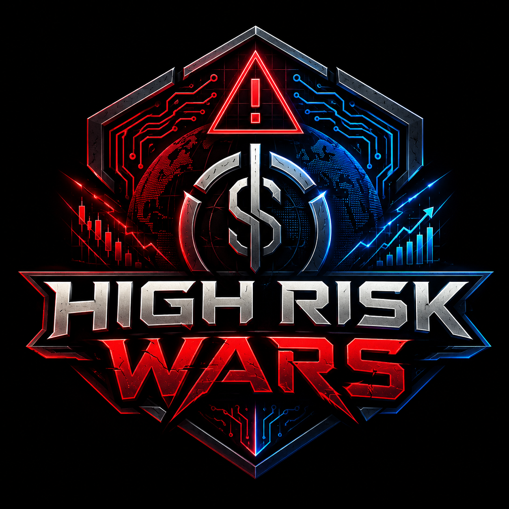

# High Risk Wars

<p align="center">
  
</p>

<p align="center">
  <strong>A 30-day merchant survival simulation about payment fragility, chargebacks, reserves, compliance pressure, and checkout resilience.</strong>
</p>

<p align="center">
  <a href="https://highriskwars.vercel.app">Live demo</a> ·
  <a href="https://github.com/MEF-works/highriskwars/issues">Issues</a>
</p>

## Why this exists

High Risk Wars turns a complicated operational problem into an interactive system: what happens when an ecommerce business depends too heavily on one payment rail and real-world failures start compounding?

The game borrows the short-run decision pressure of classic trading/survival games and applies it to merchant operations. The player has 30 days to manage cash, inventory, debt, reputation, compliance, chargebacks, reserves, processor outages, and fallback payment options without letting the business collapse.

This repository is also an experiment in **teaching systems behavior through simulation instead of explanation alone**.

## What it demonstrates

- **Stateful simulation design** — a complete game state tracks cash, debt, inventory, risk, compliance, demand, processor status, reserves, owned capabilities, and survival events.
- **Compounding operational risk** — processor shutdowns, chargeback storms, frozen reserves, store failures, overhead, and market conditions interact instead of appearing as isolated events.
- **Decision-constrained gameplay** — players receive a limited number of actions per day, forcing tradeoffs rather than unlimited optimization.
- **Multiple starting conditions** — bootstrap, scrappy, funded, and veteran profiles create materially different risk/reward curves.
- **Persistence** — game state is saved locally so a run can survive browser refreshes.
- **Real product mapping** — in-game resilience upgrades are connected to real payment and infrastructure concepts rather than generic power-ups.
- **No framework required** — the current implementation is a deliberately small static web application using HTML, CSS, and JavaScript.

## Core loop

```text
choose a starting merchant profile
            ↓
select up to three actions
            ↓
market + operational events resolve
            ↓
revenue / risk / reserves / debt change
            ↓
processor and storefront resilience is tested
            ↓
advance the day
            ↓
survive 30 days or run out of operating room
```

## Systems modeled

| System | Examples |
| --- | --- |
| **Cash flow** | revenue, overhead, debt, frozen reserves, inventory value |
| **Payments** | primary processor, backup rail, direct/P2P options, Bitcoin checkout |
| **Risk** | shutdown exposure, merchant risk score, reserve pressure |
| **Compliance** | compliance posture, reviews, audit preparation |
| **Demand** | market conditions, reputation, inventory availability |
| **Resilience** | fallback checkout paths, alternate rails, recovery options |

## Run locally

No build step is required.

```bash
git clone https://github.com/MEF-works/highriskwars.git
cd highriskwars
```

Then serve the directory with any static server, for example:

```bash
python -m http.server 8080
```

Open `http://localhost:8080`.

You can also open `index.html` directly, although a local HTTP server is a better match for the deployed environment.

## Repository structure

```text
index.html          # application shell and game surfaces
script.js           # simulation state, events, actions, scoring, persistence
styles.css          # responsive visual system
manifest.json       # web-app metadata
assets/             # scene and interface artwork
```

## Design notes

The simulation intentionally favors **visible consequences over hidden complexity**. The player should be able to understand why a run improved or deteriorated from the activity log, risk meter, active rails, cash position, and event choices.

The product links inside the game are secondary to the simulation. The engineering goal is to make payment resilience understandable by letting the player experience dependency, failure, and recovery as a system.

## Status

Playable public build. The live deployment is available at **https://highriskwars.vercel.app**.

Built by [MEF-works](https://github.com/MEF-works).
